# Модель данных и связи v2.0

## 1. Базовые правила

- PostgreSQL/Supabase остаётся единым источником данных.
- Любая таблица, доступная пользователю, получает RLS.
- Все внешние ключи имеют явно выбранное поведение удаления.
- Удаление контента по умолчанию заменяется архивированием.
- Документы формируются из ссылок на мастер-данные и неизменяемого снапшота.
- Персональные и секретные данные не хранятся в публичной схеме.

## 2. Диаграмма верхнего уровня

```mermaid
erDiagram
  AUTH_USERS ||--o| ADMIN_USERS : maps
  ADMIN_USERS ||--o{ USER_ROLES : assigned
  ROLES ||--o{ USER_ROLES : contains
  ADMIN_USERS ||--o{ PROFILE_ACCESS : scoped
  PROFILES ||--o{ PROFILE_ACCESS : permits

  PROFILES ||--o{ PROFILE_TRANSLATIONS : translates
  PROFILES ||--o| PROFILE_PRIVATE_DETAILS : protects
  PROFILES ||--o{ PRIVATE_CONTACTS : owns
  PROFILES ||--o{ APPEARANCE_PROFILES : histories
  APPEARANCE_PROFILES ||--o{ MEASUREMENTS : contains

  PROFILES ||--o{ SKILLS : has
  SKILL_CATEGORIES ||--o{ SKILLS : groups
  SKILL_SCALES ||--o{ SKILL_SCALE_LEVELS : defines
  SKILL_SCALES ||--o{ SKILLS : evaluates
  SKILLS ||--o{ SKILL_EVIDENCE : supports

  PROFILES ||--o{ EDUCATION_ENTRIES : studies
  ORGANIZATIONS ||--o{ EDUCATION_ENTRIES : provides
  PEOPLE ||--o{ EDUCATION_ENTRIES : teaches

  PROFILES ||--o{ PROJECTS : participates
  PROJECTS ||--o{ PROJECT_TRANSLATIONS : translates
  PROJECTS ||--o{ PROJECT_ROLES : defines
  PROJECTS ||--o{ PROJECT_EVENTS : schedules
  PROJECT_EVENTS ||--o{ PROJECT_EVENT_ROLES : performed
  PROJECT_ROLES ||--o{ PROJECT_EVENT_ROLES : assigned
  PROJECT_EVENT_ROLES ||--o{ PROJECT_EVENT_ROLE_MEDIA : illustrates
  MEDIA_ASSETS ||--o{ PROJECT_EVENT_ROLE_MEDIA : used

  PROFILES ||--o{ ACHIEVEMENTS : receives
  ACHIEVEMENT_TYPES ||--o{ ACHIEVEMENTS : classifies
  ACHIEVEMENTS ||--o{ ACHIEVEMENT_TRANSLATIONS : translates
  ACHIEVEMENTS ||--o{ ACHIEVEMENT_MEDIA : proves
  MEDIA_ASSETS ||--o{ ACHIEVEMENT_MEDIA : used

  PROFILES ||--o{ MEDIA_ASSETS : owns
  MEDIA_ASSETS ||--o{ MEDIA_VARIANTS : derives
  PROFILES ||--o{ MEDIA_LINKS : links
  MEDIA_ASSETS ||--o{ MEDIA_LINKS : local_source

  PROFILES ||--o{ ACTOR_DOCUMENTS : creates
  ACTOR_DOCUMENT_TEMPLATES ||--o{ ACTOR_DOCUMENTS : styles
  ACTOR_DOCUMENTS ||--o{ ACTOR_DOCUMENT_SECTIONS : arranges
  ACTOR_DOCUMENT_SECTIONS ||--o{ ACTOR_DOCUMENT_ITEMS : selects
  ACTOR_DOCUMENTS ||--o{ ACTOR_DOCUMENT_SNAPSHOTS : versions
  ACTOR_DOCUMENT_SNAPSHOTS ||--o{ GENERATED_DOCUMENTS : renders
  GENERATED_DOCUMENTS ||--o{ PROTECTED_DOCUMENT_LINKS : shares

  PROFILES ||--o{ BLOG_POSTS : publishes
  BLOG_POSTS ||--o{ BLOG_POST_TRANSLATIONS : translates
  BLOG_POSTS ||--o{ BLOG_POST_RELATIONS : relates
  BLOG_POSTS ||--o{ SOCIAL_PUBLICATIONS : distributes
  SOCIAL_ACCOUNTS ||--o{ SOCIAL_PUBLICATIONS : targets

  HELP_CATEGORIES ||--o{ HELP_ARTICLES : groups
  HELP_ARTICLES ||--o{ HELP_ARTICLE_TRANSLATIONS : translates
  ADMIN_USERS ||--o{ SUPPORT_TICKETS : opens
  SUPPORT_TICKETS ||--o{ SUPPORT_MESSAGES : contains
  ADMIN_USERS ||--o{ AI_THREADS : starts
  AI_THREADS ||--o{ AI_MESSAGES : contains
  AI_MESSAGES ||--o{ AI_SOURCES : cites
  AI_MESSAGES ||--o{ AI_ACTION_PROPOSALS : proposes
```

## 3. Шкалы навыков

### `skill_scales`

- `id`
- `code`
- `name`
- `scale_type`: five_level, cefr, binary, custom
- `min_value`
- `max_value`
- `is_system`
- `is_active`

### `skill_scale_levels`

- `skill_scale_id`
- `value`
- `label_ru`
- `label_kk`
- `label_en`
- `description_ru`
- `description_kk`
- `description_en`
- `sort_order`

### Системная пятиступенчатая шкала

| Значение | Название | Смысл |
|---:|---|---|
| 1 | Базовый | Знакомство с навыком, требуется руководство |
| 2 | Начальный практический | Может выполнить базовую задачу после подготовки |
| 3 | Уверенный | Регулярно применяет навык самостоятельно |
| 4 | Продвинутый | Стабильно применяет в сложных сценических или съёмочных условиях |
| 5 | Профессиональный | Готов к профессиональному использованию и подтверждён опытом |

### `skills`

- `profile_id`
- `skill_category_id`
- `name`
- `description`
- `skill_scale_id`
- `level_value`
- `display_level`
- `display_mode`: segments, bar, label, hidden
- `assessment_source`: self, teacher, certificate, competition, administrator
- `assessed_by_person_id`
- `assessed_at`
- `years_experience`
- `last_practiced_at`
- `verified`
- `featured`
- `visibility`
- `sort_order`

Ограничения:

- для `five_level` значение 1–5;
- при `display_level = false` шкала не выводится, но значение может храниться;
- язык использует CEFR и не переводится в произвольные пять баллов;
- водительские права, готовность к поездкам и аналогичные признаки используют отдельные поля или binary scale;
- личные качества и хобби не требуют обязательной количественной оценки.

## 4. Конфигурация актёрского документа

### `actor_documents`

- `profile_id`
- `name`
- `document_purpose`: universal, film, theatre, dubbing, audition, compact, media_kit
- `locale`
- `template_id`
- `status`
- `autosave_revision`
- `last_opened_section_id`
- `visibility`

### `actor_document_sections`

- `actor_document_id`
- `section_type`
- `title_override`
- `enabled`
- `sort_order`
- `layout_variant`
- `page_break_before`
- `settings_json`

### `actor_document_items`

- `section_id`
- `entity_type`
- `entity_id`
- `enabled`
- `sort_order`
- `display_variant`
- `override_text`

### `actor_document_snapshots`

- `actor_document_id`
- `revision_number`
- `snapshot_json`
- `source_updated_at`
- `created_by`
- `created_at`
- `checksum`

### `generated_documents`

- `snapshot_id`
- `format`: pdf, docx, html, png, zip
- `file_asset_id`
- `contains_clickable_links`
- `contains_qr_codes`
- `page_count`
- `generation_status`
- `generated_at`

## 5. Помощь и ИИ

### `help_articles`

- категория;
- slug;
- status;
- target_roles;
- target_routes;
- version;
- updated_by.

### `ai_threads` и `ai_messages`

- тип агента: help, creative, casting_analysis;
- пользователь;
- профиль;
- route context;
- privacy mode;
- retention_until;
- status.

Каждый ответ справочного агента хранит ссылки на использованные статьи через `ai_sources`. Предложения действий хранятся отдельно и выполняются только после подтверждения.

> Historical source note: model predates the later canonical domain split and architecture documents. Use as source/evidence only.
